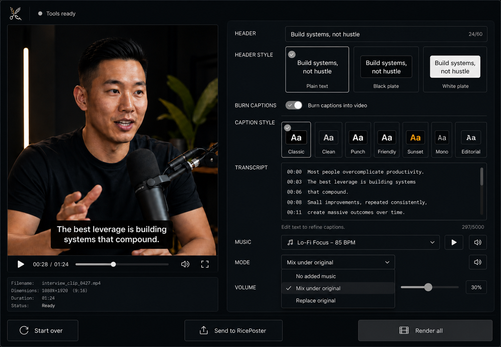
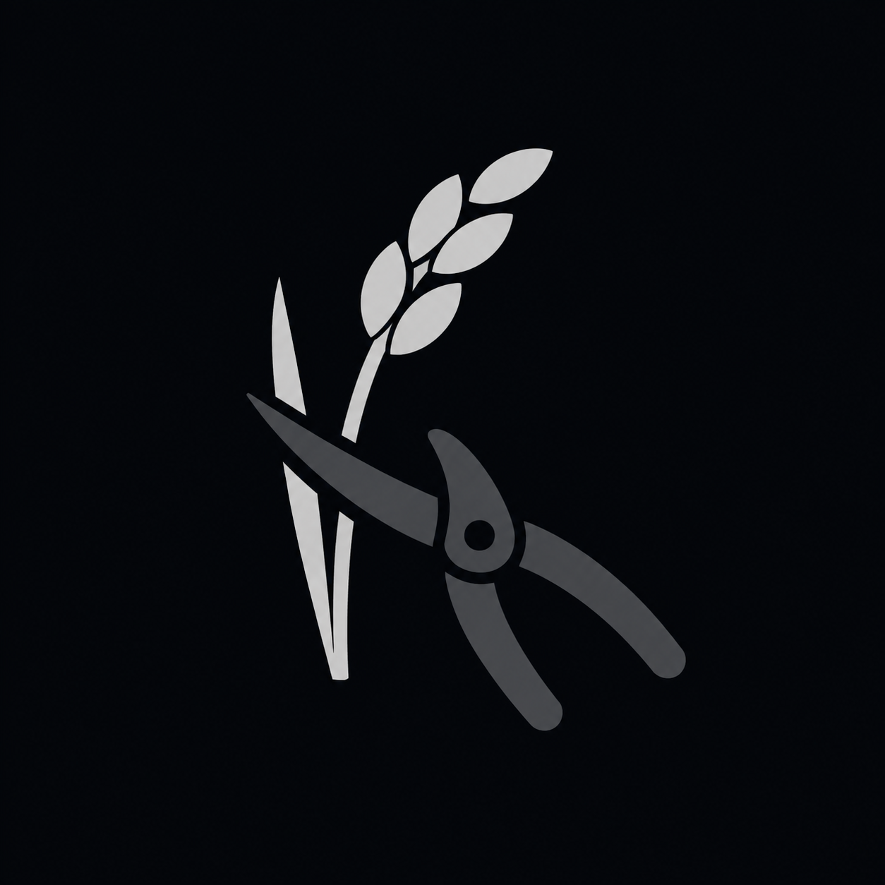

# RiceClipper Slate UI

Status: **Ratified visual contract; implementation authorized in GitHub Issue #9.**

Slate is the browser-interface theme for RiceClipper. It redesigns the existing
local review workflow without changing its behavior, data contracts, rendering
pipeline, job lifecycle, or RicePoster handoff.

## Reference assets

The selected concept and logo are the visual authority for implementation:

- [Slate interface concept](assets/slate-ui-concept.png)
- [Selected Slate logo](assets/slate-logo-selected.png)
- [Backup logo A](assets/slate-logo-backup-a.png)
- [Backup logo B](assets/slate-logo-backup-b.png)
- [Production Slate PNG](../../web/slate-logo.png)

The selected PNG is also the production app mark: `web/slate-logo.png` must
remain byte-for-byte identical to `assets/slate-logo-selected.png`. The backup
marks are retained only as decision evidence; they are not alternate runtime
themes.

## Product intent

Slate should feel like a focused editing console used every day:

- dark, quiet, and operational rather than cinematic or decorative;
- fast to scan, with the video and next action visually dominant;
- compact enough for repeated batch work without crowding controls;
- explicit about selection, status, focus, disabled state, and errors; and
- recognizably RiceClipper without a visible wordmark.

The page's single job remains unchanged: review uploaded clips, correct text,
choose existing visual treatments and audio settings, render, then download or
send the completed batch to RicePoster.

## Theme tokens

| Token | Value | Use |
| --- | --- | --- |
| Backdrop | `#04060A` | Page and top-bar background; sampled from the approved logo edge |
| Midground | `#0C1116` | Main workspace and recessed regions |
| Interior | `#14191E` | Cards, inputs, transcript, menus |
| Hairline | `#2B3136` | Decorative dividers |
| Control line | `#626A70` | Accessible inactive control boundaries |
| Rice grey | `#AEB3B6` | Selection, focus, progress, ready state |
| Muted grey | `#80878C` | AA secondary text and inactive controls |
| Charcoal | `#3B4044` | Logo shears, primary action, strong controls |
| Primary text | `#E5E8EA` | Labels and readable content |

There is no blue, amber, gold, cyan, or purple in Slate's interface chrome.
The solid top bar must use the exact backdrop token so the unchanged production
PNG blends into it without a contrasting square.
Two intentional semantic exceptions remain:

- destructive and error states retain an accessible red treatment; and
- caption-style sample tiles may show the actual preset colors they represent.

Video content and rendered-preview content are not recolored by the interface.

## Logo contract

The visible header uses the symbol only. `RiceClipper` remains the document
title and accessible application name but is not rendered as a top-bar
wordmark.

The selected symbol combines:

- the original curved rice stalk and grain arrangement from the Cut Room study;
- light rice-grey fill (`#AEB3B6`);
- pruning shears visibly closing through the stalk at one clear cut point;
- charcoal shears (`#3B4044`), visibly darker than the rice; and
- no text, letters, blue pivot, gradient, glow, shadow, or enclosing badge.

The production PNG must retain the selected composition without tracing,
redrawing, recoloring, cropping, or other reinterpretation. It must be used for
both the visible toolbar symbol and the favicon.

## Layout contract

### Global shell

- Compact top bar with the symbol and toolchain readiness grouped at left.
- Centered, wide workspace with restrained outer margins.
- Stable bottom action bar in review state.
- Maintenance/cache controls remain visually subordinate to the main workflow.

### Upload state

- The drop target remains the primary element.
- Existing multi-file upload remains unchanged.
- The universal pre-upload caption/header dropdowns are removed; per-clip style
  now seeds from a per-slot saved default (see Component contract). No visual
  preset control appears before clips exist.
- A single tool row below the drop target pairs the RiceSearcher intake (left)
  with the media-cache controls (right); the standalone bottom cache panel is
  retired. The row stays subordinate to the drop target and collapses to a
  single stack on narrow screens without introducing scroll in the upload state.

### Review state

- Video and source metadata occupy the left column.
- Header, captions, transcript, and music controls occupy the right column.
- Desktop target is approximately a 40/60 preview-to-controls split.
- Each clip retains its filename, status, removal control, geometry note, source
  preview, output preview, download link, and error/status messages.
- Multiple clips remain sequential cards in the existing bounded batch model.

### Narrow screens

- Columns collapse to one readable stack without horizontal scrolling.
- Primary actions remain reachable and do not cover editable content.
- Visual-choice tiles wrap into predictable rows and keep at least a 44 px
  interactive target.

## Component contract

### Header and caption choices

- Per-clip header styles become three accessible radio-card tiles: **Plain
  text**, **Black plate**, and **White plate**.
- Per-clip caption styles become eleven accessible radio-card tiles: **Classic**,
  **Clean**, **Punch**, **Friendly**, **Sunset**, **Mono**, **Editorial**,
  **Lyric Block**, **Velvet Serif**, **Powder**, and **Baskerville**. Powder keeps
  the stable `din_condensed` identifier and uses the DIN Condensed font.
- Each tile includes a truthful miniature treatment example and a text label.
- Selection uses a rice-grey border and checkmark, never color alone.
- The underlying values and API payload shapes remain the existing
  `header_style` and `caption_style` contracts; the bounded catalog now includes
  the four approved lyric preset identifiers.
- There is no universal batch-default select. Each slot (the "Clip N" ordinal,
  which maps to the RicePoster handoff position) has a saved caption/header
  default persisted in the browser (`localStorage`, local-first — no server
  state). A clip in slot N seeds from slot N's saved default, falling back to
  the v1 **Classic**/**Plain text** defaults when unset; changing a clip writes
  that slot's default back so it carries to the next batch and session.

### Transcript

- Preserve per-word editing and locked timestamps.
- Improve focus visibility and reading rhythm without changing word collection,
  timing, sanitization, or render payloads.

### Music

- Preserve the existing file input, mode choices, and volume range.
- Present them as one compact music section with aligned rows and a clear value.
- Choosing a music file defaults the mode to **Mix under original**, but only
  while the mode is still untouched, so a deliberate mode choice is never
  overridden. This is a convenience default, not a new mode.
- Do not add playback preview, waveform, auto-ducking, or new audio modes.

### Actions and states

- `Render all` is the single solid charcoal primary action.
- `Send to RicePoster` and `Start over` remain outlined secondary actions.
- Disabled controls must be visibly disabled and retain readable contrast.
- Keyboard focus uses a rice-grey ring distinct from hover and selection.
- Loading, ready, success, failure, and destructive states remain explicit in
  text; color is supplemental.
- Motion is unnecessary. If any transition is retained, it must respect
  `prefers-reduced-motion`.

## Behavior invariants and non-goals

Slate must not add or change:

- upload, transcription, render, download, cache, or handoff behavior;
- API endpoints, request/response shapes, or defaults;
- clip trimming, a timeline, crop/reframe controls, duplicate settings, or
  replacement controls;
- music preview, waveforms, extra modes, or audio processing;
- arbitrary font/color editing or user-authored preset persistence;
- posting, publishing, authentication, or external content upload; or
- arbitrary caption/header editing beyond the bounded selectable presets.

HTML may be reorganized for semantics and styling. JavaScript may change only
where required to bind the same existing behavior to accessible controls.

## Implementation acceptance

The implementation is complete only when:

1. Upload, single-clip, multi-clip, ingesting, ready, rendering, done, error,
   cache, and RicePoster-handoff states use Slate consistently.
2. Every existing control and value is present and functional.
3. Header and caption radio cards send the existing payload values.
4. The selected logo is shipped unchanged as the runtime PNG and remains
   recognizable at toolbar and favicon scale.
5. Desktop and narrow layouts show no unintended overflow or obscured actions.
6. Keyboard-only use has visible focus and logical order.
7. Controls and essential text meet WCAG AA contrast targets.
8. Reduced-motion behavior is respected.
9. Existing functional tests remain green and focused UI-contract tests cover
   visual-choice values, labels, and payload wiring.
10. Browser screenshots cover upload and representative review states at wide
    and narrow viewports, with console and overflow checks recorded separately.
11. Repository lint, format, coverage, test, JavaScript syntax, and diff checks
    pass without weakening existing gates.

## Decision record

- Theme name: **Slate**.
- Layout: Studio Light control hierarchy adapted to Cut Room's dark backdrop.
- Identity: selected symbol-only rice-and-shears mark; no visible wordmark.
- Chrome: monochrome carbon, grey, and rice-grey; no blue highlight system.
- Visual selectors: treatment-preview radio cards for per-clip header and
  caption choices.
- Music: retain the existing functional surface and apply the compact Slate
  presentation only.
- Delivery boundary: visual redesign only; no features or render changes.
